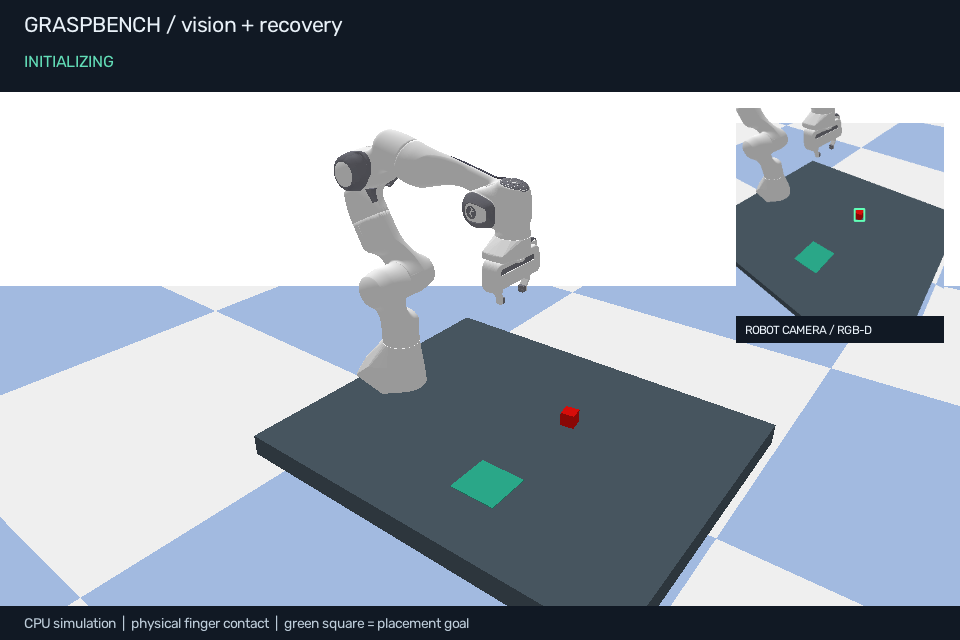

# GraspBench

**Robust Closed-Loop Manipulation in Simulation with Vision-Based Grasp Recovery**

A small working robotics project: a Franka Panda sees a red cube through a simulated
RGB-D camera, picks it up with physical finger contact, checks the lift visually,
and places it in a marked goal. If the lift fails, it retreats, observes the scene
again, and tries another gripper orientation. It runs locally on a CPU with no
hardware, GPU, paid service, training data, or model downloads.

This is the first milestone: a classical vision and control baseline with a reproducible
evaluation. It contains no learned model yet.

The recorded pilot completed 80 episodes (10 seeds per policy/condition). Success
with one attempt versus recovery was 10/10 versus 10/10 in clean scenes, 10/10
versus 10/10 with 6-mm error, 9/10 versus 10/10 with 16-mm error, and 0/10 versus
10/10 with the injected first-attempt error. All 10 tests passed. One noisy
baseline placement succeeded physically but was not confirmed visually; this
false negative is retained in the logs. See `outputs/benchmark/report.md` for
confidence intervals and limitations, and `outputs/recovery-demo.mp4` for the demo.



[Watch the recovery demo](outputs/recovery-demo.mp4) · [Read the benchmark report](outputs/benchmark/report.md)

## Run the installed project

Open a terminal in this folder after following the setup instructions below.
On the original development Mac, the isolated `.venv` is already installed.

```sh
# Fast headless run, with an explicit failed first attempt followed by recovery
.venv/bin/grasp-demo demo --first-miss

# Interactive simulator (closes when the episode finishes)
.venv/bin/grasp-demo demo --first-miss --gui

# Annotated video, including the robot's camera feed
.venv/bin/grasp-demo demo --first-miss --video outputs/recovery-demo.mp4

# 10 scenes x 2 policies x 4 conditions = 80 full episodes
.venv/bin/grasp-demo benchmark --episodes 10

# Tests, including physical grasps and camera geometry
.venv/bin/python -m pytest -q
```

The default seed is 7. Try `--seed 42`, `--attempts 1`, or `--noise 0.016` on the
demo command. Noise is a standard deviation in metres applied to the estimated
grasp x/y, so 0.016 means 16 mm. `--first-miss` applies a labeled 75-mm y offset
to the first attempt only. It does not force the simulator outcome; the physics
and visual verifier still decide what happened.

GUI playback runs at approximately real time. Headless evaluation runs faster;
MP4 recording takes longer because it renders every frame in software. If a GUI
window is unavailable, the headless demo, camera PNGs, and MP4 still work.

## Set up on another machine

Use Python 3.10 or newer. Python 3.12 was tested on Apple Silicon. Clone the repository
and enter its directory first, then create your own environment; `.venv` is not included.

```sh
python3 -m venv .venv
source .venv/bin/activate
python -m pip install -e '.[dev]'
grasp-demo demo --first-miss
```

On Windows, activate with `.venv\Scripts\Activate.ps1` instead. On platforms without
a prebuilt PyBullet wheel, pip compiles it and needs a C++ compiler. The first install
on this Mac compiled successfully. `requirements-tested.txt` records exact runtime
versions from this run; package versions alone do not ensure identical contact
physics across platforms.

## What the robot does

1. **Observe:** render a 320 x 320 RGB image and OpenGL depth buffer.
2. **Localize:** use HSV color segmentation to find the red cube; invert the
   camera projection to convert visible pixels to world points.
3. **Approach and grasp:** use the known 4-cm cube size to estimate its center,
   then execute an overhead grasp with inverse kinematics and joint motors.
4. **Verify lift:** require two visual observations showing the cube above 12 cm
   and close to the measured gripper position.
5. **Place:** transport to the known green goal square, release, and visually
   check that the cube is inside it near table height.
6. **Recover:** lower and open if the lift was uncertain, retreat, reacquire the
   target, and try again with a changed yaw. Stop after the attempt budget.

There is no invisible attachment between cube and gripper. The only constraint
couples the two finger joints, as in the Panda gripper. Gravity, contacts and
friction hold the object. Joint reset is used only for initial scene setup.

The controller consumes RGB-D observations, known camera calibration, known cube
size, a known goal pose, and robot kinematics. It does not use object IDs, ground-truth
segmentation masks, object coordinates or contact labels to decide success. The
test suite blocks object-position queries during a policy run to check this boundary.
The evaluation code separately reads simulator truth to score the final outcome.

The feedback loop operates between actions; it is not continuous visual servoing.
Within each move the robot tracks a Cartesian waypoint trajectory. These overhead
trajectories are intended for the single-object, uncluttered scene; there is no
general collision-free motion planner or self-collision benchmark.

## Evaluation and outputs

The benchmark compares **one attempt** with **up to three attempts with fresh
observations and changed yaw**. Each uses identical initial scene seeds and the
same first-attempt error draw.

| Condition | Perturbation |
|---|---|
| `clean` | Random cube x/y and yaw; ideal calibration |
| `noise_6mm` | Independent Gaussian error in estimated x/y, sigma 6 mm |
| `noise_16mm` | Independent Gaussian error in estimated x/y, sigma 16 mm |
| `forced_first_miss` | 75-mm y error on the first attempt only |

Success requires the actual cube center to be within 45 mm of the goal center on
both horizontal axes, within 10 mm of its expected resting height, and moving
slower than 20 mm/s. The controller's visual decision is logged separately, so
false-positive and false-negative task decisions are visible.

Files generated by the commands:

| File | Contents |
|---|---|
| `outputs/demo/trace.json` | Every state transition, attempt, estimated target and final score |
| `outputs/demo/scene.png` | Scene preview with camera inset |
| `outputs/demo/camera.png` | Initial RGB observation with detection rectangle |
| `outputs/recovery-demo.mp4` | Recorded recovery demonstration, if requested |
| `outputs/benchmark/report.md` | Human-readable results with Wilson 95% intervals |
| `outputs/benchmark/summary.json` | Aggregates and environment metadata |
| `outputs/benchmark/episodes.csv` | Per-episode metrics for plotting |
| `outputs/benchmark/episodes.jsonl` | Detailed traces, saved after every completed episode |

Repeating a command with the same output directory replaces its previous run.
Use `--out outputs/my-experiment` for a separate experiment. The `--video` location
is independent of `--out`. The recorded demo and benchmark are included in this
repository. Other experiment folders, caches and the local environment are ignored
by Git. Use a new output directory to preserve the recorded reference run.

The three-attempt policy has a larger time/action budget. This comparison measures
the practical value of allowing recovery, not an improvement over equal-budget
retries. The forced error is a diagnostic scenario, not a realistic sensor model.
Ten scenes per condition form a pilot, not strong evidence of general robustness.

## Read and extend the code

| Module | Role | First useful experiment |
|---|---|---|
| `graspbench/perception.py` | Color segmentation and RGB-D geometry | Add depth noise before backprojection |
| `graspbench/simulation.py` | Scene, camera, robot and physical motion | Randomize cube size and friction |
| `graspbench/controller.py` | Action state machine and visual verification | Compare fixed-yaw and changed-yaw retries |
| `graspbench/cli.py` | Demo, scoring and paired benchmark | Add an equal-budget three-attempt baseline |
| `tests/test_graspbench.py` | Geometry and end-to-end regression checks | Add failing scenes as regression cases |

The most useful next portfolio experiments, in order:

1. Evaluate at least 100 held-out seeds per condition and plot success versus
   localization error with confidence intervals. Keep tuning and evaluation seeds separate.
2. Add an equal-budget retry baseline, then isolate the benefit of re-observation,
   yaw changes and different recovery motions through ablation experiments.
3. Add realistic depth corruption, camera calibration error, occlusion and friction
   variation separately. Report each failure mode rather than mixing all changes.
4. Add an RGB-D crop dataset and train a small grasp-success classifier. Save all
   attempts, including failures; split by scene seed before extracting samples.
5. Compare geometric grasp ranking, learned ranking, and learned ranking with
   recovery on previously unseen scenes and objects.

Known limitations: a single known red cube; approximately upright pose assumption;
fixed illumination; exact camera calibration; no clutter; no learned confidence
estimator; visual occlusion can produce false failures; simple waypoint motions;
unvalidated transfer to real hardware. The current system is a useful measured
starting point for studying those limitations.

## References

- [PyBullet documentation](https://github.com/bulletphysics/bullet3/blob/master/docs/pybullet_quickstart_guide/PyBulletQuickstartGuide.md.html): rendering, inverse kinematics, motors and contacts.
- [Bundled Panda model](https://github.com/bulletphysics/bullet3/blob/master/examples/pybullet/gym/pybullet_data/franka_panda/panda.urdf): supplied by `pybullet_data`; retain upstream asset licensing when redistributing it.
- [Upstream Panda example](https://github.com/bulletphysics/bullet3/blob/master/examples/pybullet/gym/pybullet_robots/panda/panda_sim.py): model and end-effector conventions.
